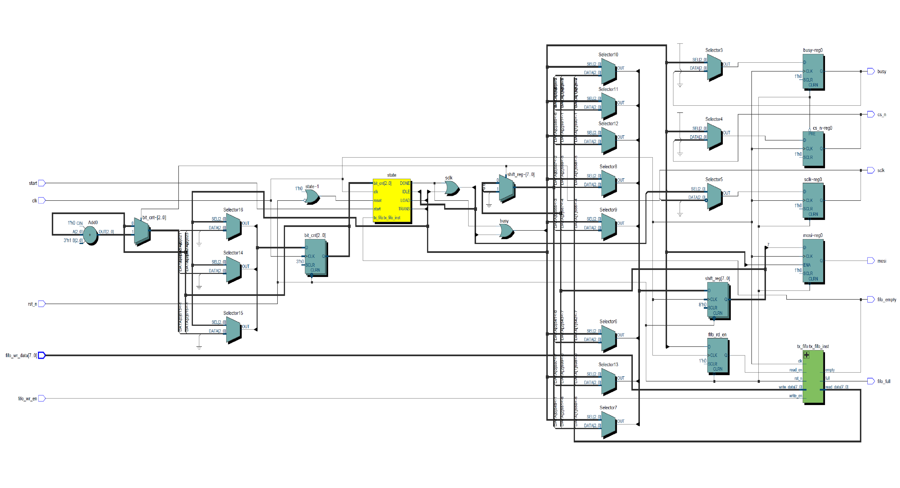
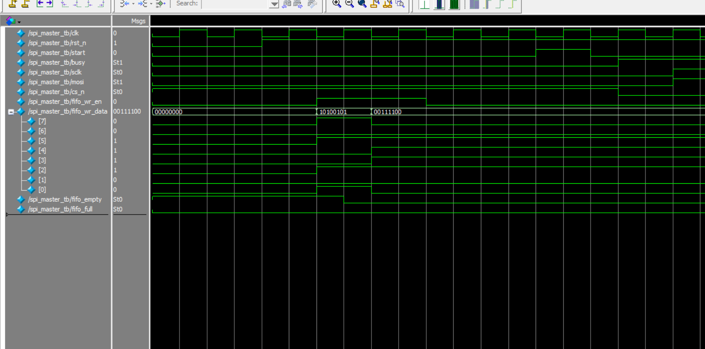

# SPI Master with FIFO Transmit Buffer

This project implements an SPI Master module in Verilog, enhanced with a transmit-side FIFO buffer.  
It includes a simulation testbench and waveform verification using ModelSim.

---

## 📌 Features

- ✅ **SPI Master** (8-bit)
- ✅ **FIFO transmit buffer** (configurable depth)
- ✅ FSM-based state control
- ✅ Verilog testbench (`spi_master_tb.v`)
- ✅ Verified waveform output
- ✅ Modular design (`spi_master.v`, `tx_fifo.v`)

---

## 📁 File Overview

| File | Description |
|------|-------------|
| `spi_master.v` | SPI Master core module with FSM and FIFO integration |
| `tx_fifo.v` | Circular FIFO buffer for transmit data |
| `spi_master_tb.v` | Verilog testbench for functional verification |
| `RTL_spi_master.png` | Block diagram of RTL architecture |
| `wave_spi_master_tb.png` | ModelSim simulation waveform screenshot |

---

## 🧠 RTL Block Diagram



---

## 🔍 Waveform Verification

- First byte sent: `0xA5`
- Second byte sent: `0x3C`
- Observed correct timing on `sclk`, `mosi`, `cs_n`, and `busy`

📷 Simulation result:



---

## 🛠 Simulation Info

- Simulated using: **ModelSim 10.5b (Intel Edition)**
- Time resolution: `1ns`
- Clock frequency: 100MHz
- Reset, data input, and start signal controlled in testbench

---

## 🚀 How to Run (ModelSim)

```tcl
vlog src/spi_master.v src/tx_fifo.v tb/spi_master_tb.v
vsim spi_master_tb
add wave *
run -all
